# Hi, I’m CIL 👋  
*Junior @ UTA • Computer Science • builder of tiny chaotic things*

  

> caffeine + commits + “Cigarettes After Sex” on repeat

## what I’m up to
- **FixiePixie:** 📷 ➜ 📍 ➜ 📬 for city fixes. `Node.js · OAuth · JWT · bcryptjs · Nodemailer · SQLite · OpenStreetMap · HTML/CSS/JS`
- **Pi-CCTV (cat edition):** Raspberry Pi + webcam + “is that Mimi or Momo?”  `Raspberry Pi · Python · OpenCV-ish · DIY`
- **Cil Linktree — Spotify Now Playing** — a minimal, dark, cyber-goth link-in-bio that shows your live Spotify track.  
  `Flask · Spotipy · HTML/CSS/JS`

- Portfolio: _coming soon (probably deployed at 3 a.m.)_

### 🎵 Now Playing (usually)
- “Soft, hazy, heart-heavy” 🤍 — CAS  
- “Poetic Nepali soul” 🌿 — Bartika

## semi-FAQ
-**Favorite debugger?** a friend looking over my shoulder
-**Matcha?** Yes 
